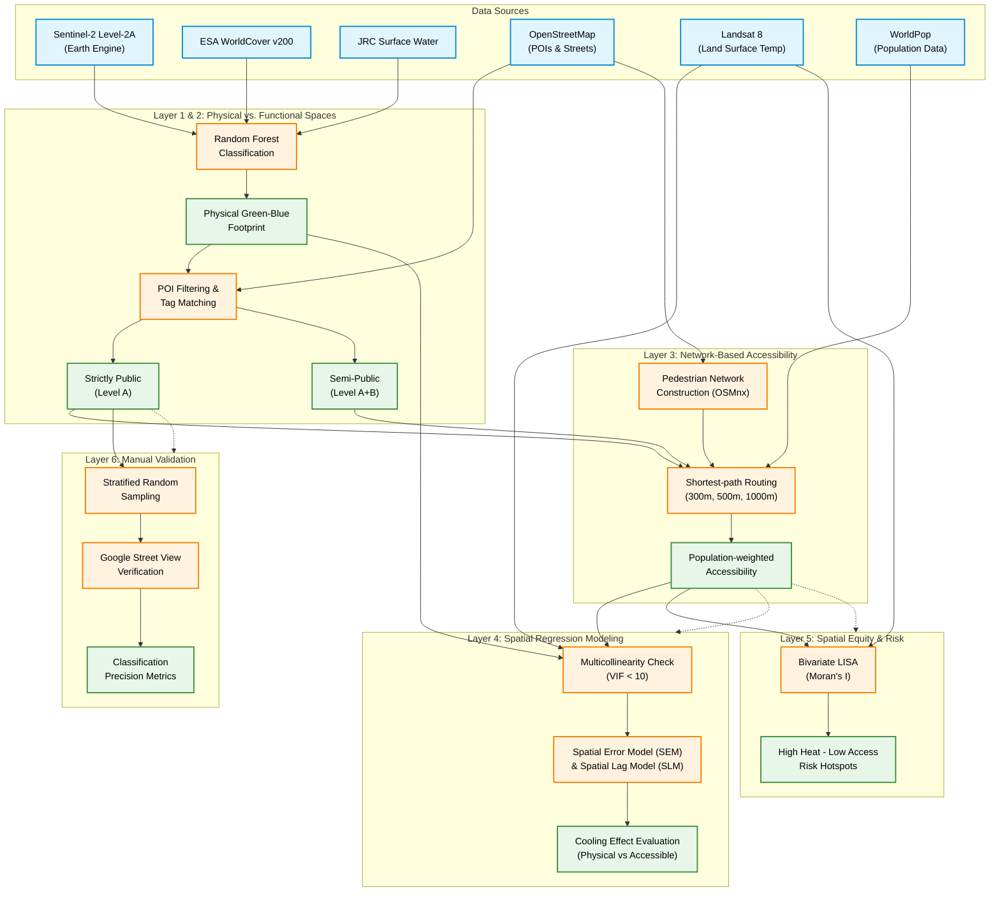

# Methodological Framework

The following diagram illustrates the 6-layer spatial data science pipeline used in this study. You can copy this Mermaid code into tools like [Mermaid Live Editor](https://mermaid.live/) or draw.io to generate a high-resolution figure for your manuscript.

