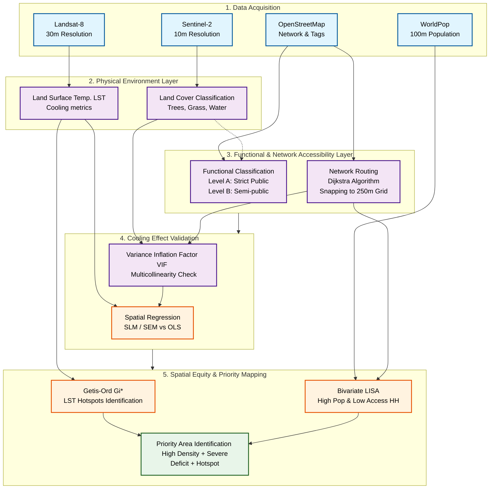

# Methodological Framework

Dưới đây là sơ đồ Mermaid mô phỏng khung phương pháp luận (Methodological Framework) cho bài báo của bạn. Bạn có thể copy mã nguồn này vào [Mermaid Live Editor](https://mermaid.live/) hoặc Draw.io để vẽ lại, hoặc xem trực tiếp trên các trình đọc Markdown.

## Gợi ý cách thiết kế trên file thực tế (Draw.io / Visio / PowerPoint):
Để biểu đồ nhìn chuyên nghiệp nhất trong bài báo quốc tế, bạn nên phân bổ theo **chiều dọc** (từ trên xuống dưới) với 5 "tầng" (Layers) rõ rệt:
1. **Tầng trên cùng (Inputs):** Hiển thị các hộp dữ liệu đầu vào. Hãy chèn thêm các icon nhỏ minh họa (vệ tinh cho Sentinel/Landsat, logo bản đồ cho OSM, biểu tượng hình người cho WorldPop) để nhìn trực quan và đỡ nhàm chán.
2. **Tầng thứ hai (Physical):** Thể hiện các thuật toán trích xuất dữ liệu vật lý cơ bản (LST, Land Cover).
3. **Tầng thứ ba (Accessibility - Trái tim của bài):** Ở tầng này, bạn vẽ hai luồng chạy song song: 
    - Một luồng phân loại tính chất công cộng (Functional Classification: Level A, B).
    - Một luồng tính toán khoảng cách đi bộ mạng lưới (Network Routing: Dijkstra).
4. **Tầng thứ tư (Analysis/Validation):** Khối Hồi quy Không gian (Spatial Regression) để chứng minh giả thuyết.
5. **Tầng dưới cùng (Outputs/Equity):** Các phân tích công bằng không gian (Hotspots, Bivariate LISA) và Kết quả cuối cùng - Bản đồ Vùng Ưu tiên (Priority Areas).

**Mẹo về màu sắc:** 
Nên dùng màu sắc thống nhất và có ý nghĩa đồ họa. Ví dụ: Dùng viền xanh lá cho khối dữ liệu mảng xanh, xanh dương cho nước, màu cam/đỏ cho các khối liên quan đến nhiệt độ (LST/Hotspot), và màu đen/xám cho dân số. Điều này giúp người đọc lướt qua là bắt được logic luồng dữ liệu ngay lập tức.
